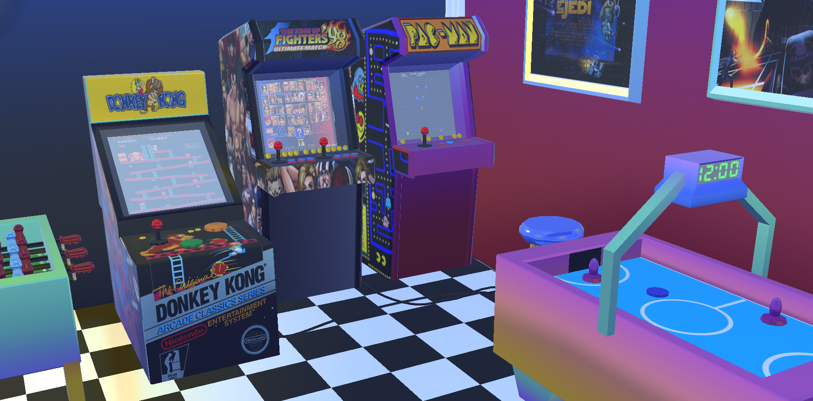

# PACMAN CXFX (Under Development)

<p align="center">
    
</p>

Pacman CXFX is a port from the original CX based [game](https://github.com/galah4d/pacman-3d) based on the CXFX library.
This game is being developed with the following objectives:

  - Demonstrate the features available on [CXFX](https://github.com/SkycoinProject/cxfx)
  - Test and document the game library
  - Increase awareness for the Skycoin Project (developers of CX and CXFX)

## What is CX?
CX is a general purpose, interpreted and compiled programming language, with a very strict type system and a syntax similar to Golang's. CX provides a new programming paradigm based on the concept of affordances, where the user can ask the programming language at runtime what can be done with a CX object (functions, expressions, packages, etc.), and interactively or automatically choose one of the affordances to be applied.

You can find more info on:
  - The github repo of CX - https://github.com/SkycoinProject/cx/
  - The official website of CX - https://www.skycoin.com/cx/
  - The official website of Skycoin - https://www.skycoin.com/

## The CXFX Library
CXFX’s objective is to facilitate the development of games and applications using CX, allowing developers to focus on building their apps instead of having to write everything from scratch!
At first, CXFX will be a library-only environment, allowing you to access CXFX functionalities from a CX program.
The eventual goal is to have something like a WYSIWYG (what you see is what you get) game editor, like Unity.

More info available at:
  - The github page of CXFX - https://github.com/SkycoinProject/cxfx/
  - The official Telegram for CXFX - https://t.me/Skycxfx

## Getting Started

### Requirements:
#### CX (programming language):
Skycraft requires the latest version of [CX v0.7.1](https://github.com/SkycoinProject/cx/releases/tag/v0.7.1).

The binaries for this version are available for:
  - [linux](https://github.com/SkycoinProject/cx/releases/download/v0.7.1/cx-0.7.1-bin-linux-x64.zip)
  - [mac-os](https://github.com/SkycoinProject/cx/releases/download/v0.7.1/cx-0.7.1-bin-macos-x64.zip)
  - [windows](https://github.com/SkycoinProject/cx/releases/download/v0.7.1/cx-0.7.1-bin-windows-x64.zip)

Preferably you can build CX from [source](https://github.com/SkycoinProject/cx/tree/develop) by following the steps showcased on the official [README](https://github.com/SkycoinProject/cx/blob/develop/README.md).

#### CXFX (game library):
Follow the official CXFX installation process available [here](https://github.com/SkycoinProject/cxfx/blob/master/README.md).
Alternatively overview of the installation process can be found bellow:
````bash
mkdir -p ~/go/src/github.com/SkycoinProject/
cd ~/go/src/github.com/SkycoinProject/
git clone https://github.com/SkycoinProject/cxfx
cd ~/go/src/github.com/SkycoinProject/cxfx/games/skylight
make
cd ~/go/src/github.com/SkycoinProject/cxfx/tutorials
make 6_model
````

### Installation:
In order to install the Pacman CXFX simply download the source code by typing:
```bash
git clone https://github.com/taekwondouglas/pacman-cxfx.git
```

### Getting Started
Run a development version (pre-alpha) by typing:
```bash
make run
```

## Contribute
If you have any questions regarding this project or CX in general feel free to dm me on [telegram](https://t.me/taekwondouglas).
